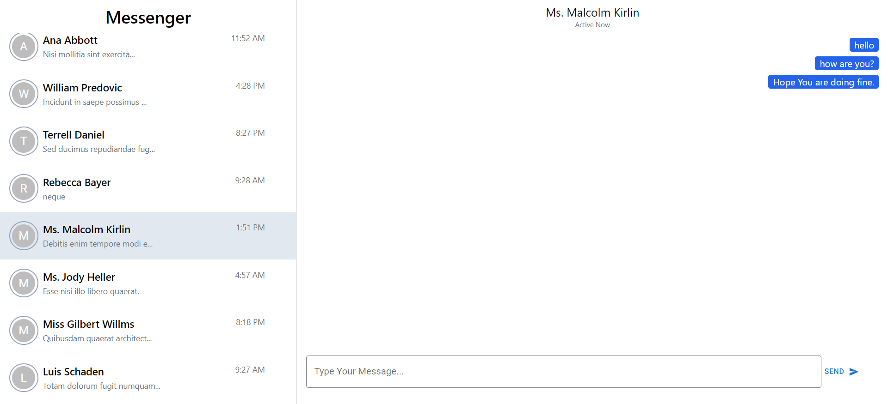

# Chat Application

## Overview

This is a simple chat application built using React.js, Tailwind CSS, Material-UI, and MockAPI.io. The app allows users to view and send messages within a chat interface.


- **Responsive UI**: The chat interface is designed to be responsive and works seamlessly across different devices.
- **Reusable Components**: The application is built with reusable components, making it easy to maintain and extend.
- **Mock API Integration**: Utilizes MockAPI.io for backend data simulation.

## Technologies Used

- **React.js**: JavaScript library for building user interfaces.
- **Tailwind CSS**: Utility-first CSS framework for styling.
- **Material-UI**: React components for faster and easier web development.
- **MockAPI.io**: Tool for simulating RESTful APIs.
- **Vite**: Next-generation frontend tooling for faster builds.


## Installation

1. Clone the repository:

   ```bash
   git clone https://github.com/Atif409/chat-web-app

## Project UI


